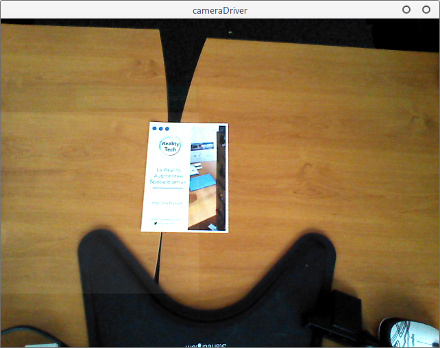

# PapARt as a Camera library

## Getting started

**PapARt** can handle many camera drivers going from classic **webcam** drivers to **depth camera** drivers allowing easy depth, IR, and color frame grabbing from such cameras.

In this quick guide you will be taught how to access and use your camera video stream through the **PapARt** library

### Requirements

* A camera \(Webcam, Kinect, Realsense, Astra, FLIR/Pointgrey\)
* **Linux**/**Windows**/**OSX**
* A working **Processing & PapARt** installation 


If you do no know how to install **PapARt**, you can check out this [guide](../download-and-installation.md#the-papart-library-and-its-dependencies).


### \(Optional\) Install camera drivers

If you are using a camera that requires proprietary drivers you must first install them and make them work so they can later be used by **PapARt**.  
Usually each camera vendor provides its own drivers.

### Drivers usage

At this step you should know what driver you should be using for your webcam thus all that is left to do is to specify it to **PapARt**.  
When **PapARt** needs to access a camera it reads a configuration file called `cameraConfiguration.xml` located in the `PapARt/data/calibration/` folder. It is the file that needs to be edited with your own camera configuration.


```markup
<?xml version="1.0" encoding="UTF-8"?>
<Calibration>
  <Camera CameraFormat="rgb" CameraName="0" CameraType="OPENCV"/>
</Calibration>

```


Here is a brief description of that file:

* **CameraFormat** describes the format of your camera. It is only used by few drivers such as `OPENNI2 | OPEN_KINECT | REALSENSE`. It can be `rgb | ir | depth`
* **CameraName** describes the name \(and most of the time the device ID\) of your camera.
* **CameraType** defines what driver **PapARt** will use to access your camera. It can be `PROCESSING | OPENCV | FFMPEG | OPEN_KINECT | REALSENSE | OPENNI2 | NATAR`

For more information about how to edit this file and how to test your camera driver, please refer to the following links:

* [OPENCV](opencv.md)
* [PROCESSING](processing.md)
* [OPENNI2](openni2.md)
* [FFMPEG](ffmpeg.md)
* OPEN\_KINECT
* [REALSENSE](realsense.md)
* [NATAR](natar.md)

### Conclusion

At this step, **PapARt** is ready to be used as a camera library.   
In Processing,  open the `Papart-examples` folder and try running the `first-examples -> camera -> cameraDriver` sketch to ensure that everything is working.




