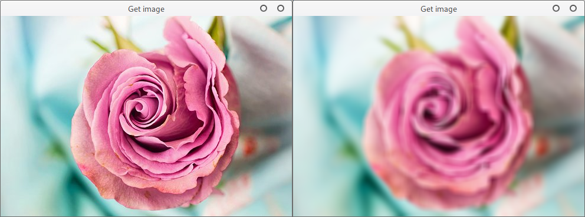

# Image

## Getting Started

In this guide we will learn how we can make a simple **Image blur** service for **Natar** using **C++** and **OpenCV**.  
The goal of the service is to access image data from the Natar server, apply a blur algorithm, in our case a gaussian blur, to the image and set the result back into Natar so it will be accessible by other services.


You will need to have access to an up and running **Natar server** from which we are going to get and set our generated images.


### Requirements

* [CMake ](https://cmake.org/)\(3.2 or higher\)
* [Redis](https://redis.io/)
* [Hiredis](https://github.com/redis/hiredis)
* OpenCV
* [RedisImageHelper](https://forge.pole-aquinetic.net/nectar-platform/redis-image-helper/)


**CMake, Redis, Hiredis & OpenCV** are available as packages for most operating systems.


### CMake

`src/ (containing the source file)  
cmake/module/ (containing all the .cmake needed to find the required libraries)  
CMakeLists.txt`

The service will be built using CMake with the following **CMakeLists.txt**


```cpp

cmake_minimum_required (VERSION 3.2)
project (natar-blur VERSION 0.1)

set (CMAKE_CXX_STANDARD 11)
set (CMAKE_MODULE_PATH ${CMAKE_MODULE_PATH} ${CMAKE_CURRENT_SOURCE_DIR}/cmake/module)

find_package(OpenCV REQUIRED core opencv_imgcodecs opencv_highgui opencv_imgproc opencv_videoio opencv_aruco)
if (NOT OpenCV_FOUND)
    message(FATAL_ERROR "Could not find OpenCV")
endif()

find_package(redisimagehelper REQUIRED)
find_package(hiredis REQUIRED)
find_package(RapidJSON REQUIRED)
find_package(ev REQUIRED)
find_package(cxxopts REQUIRED)

include_directories(${REDISIMAGEHELPER_INCLUDE_DIR})

set(BLUR_SERVER
        src/server.cpp)
add_executable(${PROJECT_NAME} ${BLUR_SERVER})
target_link_libraries(${PROJECT_NAME} ${OpenCV_LIBS} ${REDISIMAGEHELPER_LIBS} ${HIREDIS_LIBS} ${EV_LIBS})
```


### Building the service

In order to build our service we need to do several things:

1. Connect to **Natar.**
2. Get an image from it.
3. Convert this image into an OpenCV image so it can be processed.
4. Process the image with our Gaussian blur.
5. Convert the generated OpenCV image back into a Natar Image format.
6. Set the image into Natar.

#### Connecting to Natar

Using the RedisImageHelper library, we create a `RedisImageHelperSync` object which will allow us to setup a connection between Redis \(the Natar server\) and our application. 

```cpp
std::string host = "127.0.0.1";
int port = 6379;

RedisImageHelperSync clientSync(host, port, "");
if (!clientSync.connect()) {
    // The connection failed here
    return EXIT_FAILURE;
}
```


In this example we use the synchronous API of the library.  
For more information on the asynchronous client please refer the [RedisImageHelper ****library documentation](http://natar.io).


#### Get an image

Now that the service is connected to **Natar** we should be able to access some data.  
Since **Natar** is based on **Redis**, data are stored using unique keys which means that when you want to access the data you must know the key it is stored at.  
In my case the image I want to access is stored at `image:rose`

```cpp
std::string imageKey = "image:rose";
int width = clientSync.getInt(imageKey + ":width");
int height = clientSync.getInt(imageKey + ":height");
int channels = clientSync.getInt(imageKey + ":channels");

Image* image = clientSync.getImage(width, height, channels, imageKey);
if (image == NULL) {
    // Accessing the image failed here
    return EXIT_FAILURE;
}
```


In **Natar**, when writing an image, we always write its width, height and channel number which are critical informations that we need everytime we acces an image.


#### Converting from Natar to OpenCV

OpenCV images are stored as BGR matrices while in Natar images are stored as RGB array of `unsigned char` therefore we need to do a quick conversion.

```cpp
cv::Mat rgbImage = cv::Mat(image->height(), image->width(), CV_8UC3, (void*)image->data());
cv::Mat bgrImage;
cv::cvtColor(rgbImage, bgrImage, cv::COLOR_RGB2BGR);
```

#### Processing the image

```cpp
cv::Mat blurImage;
cv::GaussianBlur(bgrImage, blurImage, cv::Size(11, 11), 11);
```

#### Converting from OpenCV to Natar

```cpp
cv::Mat rgbOutputImage;
cv::cvtColor(blurImage, rgbOutputImage, cv::COLOR_BGR2RGB);
Image* outputImage = new Image(rgbOutputImage.cols, rgbOutputImage.rows, rgbOutputImage.channels(), rgbOutputImage.data);
```

#### Set the image to Natar

Finally, we perform a call to `setImage` with the output key to set the final image back into **Natar**.

```cpp
clientSync.setImage(outputImage, imageKey + ":blurred");
```

### Results




You can find the full source code at [https://github.com/natar-io/natar-blur](https://github.com/natar-io/natar-blur)


