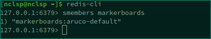

# Pose Estimator

The pose estimation is a process that allows to retrieve an object transformation \(rotation & translation\).  
To perform a such task it requires that the object is marked and that its model is accessible.

In our case models are for now mostly markerboards and must be stored in **Redis** inside the markerboards set. Accessing the `markerboards` keys in **Redis** will give you the list of available markerboards:


Markerboards are stored in **JSON** and can be loaded into Redis using the ConfigurationLoader application. You can refer to this article if you want to know more: [How to load configurations file into redis](../../)


The Pose Estimator is build upon [detection services](./) that will usually push their data in `$key:markers`.  
`$key` refers to the key used by the detection service in the first place.   
For example if the aruco detection service uses the image from the camera called `camera0` to detect aruco markers, the result will be published in `camera0:markers`.

Once a detection service publishes its results into **Redis,** the pose estimator receives this data and can performs the pose estimation for each markerboards using the incomming detection informations. When it is done the service publishes each computed poses into **Redis** at `$key:$markerboard-key`.  
`$markerboard-key` refers to the name of the used model in the smembers list.  
For exemple in our case, the result will be published/set in `camera0:markerboards:aruco-default`.  

