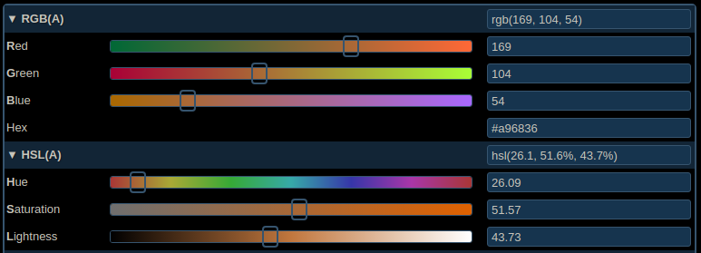

# Color Converter for Processing LAB

### Introduction to color representations

Computers usually work with RGB \(Red, Green, Blue\) colors that are used more or less directly to display pixels to screens. In Processing there are two color models: RGB and HSB \(Hue, Saturation, Brightness\). The HSB model is closer to what we understand of color.   


Check out the [Color tutorial](https://processing.org/tutorials/color/) on Processing.org to have a great introduction to color in Processing.


You can experiment with color models on the [colorizer.org](http://colorizer.org/) website. They feature also CMYK used in printing, [Lab](https://en.wikipedia.org/wiki/CIELAB_color_space) used for computer vision and the [XYZ](https://fr.wikipedia.org/wiki/CIE_XYZ) standard.



### ColorConverter Library

The library is hosted on github: [https://github.com/Rea-lity-Tech/ColorConverter](https://github.com/Rea-lity-Tech/ColorConverter). The source code is from the [ImageJ library](https://imagej.nih.gov/ij/). We wrapped the code and created an example for Processing. Here is how to use it: 

```java
  
import tech.lity.rea.colorconverter.ColorConverter;
// ...
ColorConverter converter;
void setup(){
    converter = new ColorConverter();
    // ...
}
void draw(){
     // ...
     //  l values are from 0 to 100, 
     //  a and b values are between -128 and 128. 
     int[] rgb1 = converter.LABtoRGB(l, a, b);
    fill(rgb1[0], rgb1[1], rgb1[2]);
    rect(20, 20, 100, 100);
}
```

Full example on github: [lab.pde](https://github.com/Rea-lity-Tech/ColorConverter/blob/master/examples/lab/lab.pde). 

#### [Download the library for Processing](https://github.com/Rea-lity-Tech/ColorConverter/releases/download/0.1/ColorConverter.tgz):  [ColorConverter.tgz](https://github.com/Rea-lity-Tech/ColorConverter/releases/download/0.1/ColorConverter.tgz)

### Documentation 

Here are the prototypes of the methods you can use: 



```java
 /**
     * @param H Hue angle/360 (0..1)
     * @param S Saturation (0..1)
     * @param B Value (0..1)
     * @return RGB values
     */
    public int[] HSBtoRGB(double H, double S, double B)
    public int[] HSBtoRGB(double[] HSB)
    
    public int[] LABtoRGB(double L, double a, double b) 
    public int[] LABtoRGB(double[] Lab)
   

    public double[] LABtoXYZ(double L, double a, double b)
    public double[] LABtoXYZ(double[] Lab)
    
     /**
     * @param R Red in range 0..255
     * @param G Green in range 0..255
     * @param B Blue in range 0..255
     * @return HSB values: H is 0..360 degrees / 360 (0..1), S is 0..1, B is
     * 0..1
     */
    public double[] RGBtoHSB(int R, int G, int B) 
    public double[] RGBtoHSB(int[] RGB)
     

    public double[] RGBtoLAB(int R, int G, int B)
    public double[] RGBtoLAB(int[] RGB) 
    

    public double[] RGBtoXYZ(int R, int G, int B) 
    public double[] RGBtoXYZ(int[] RGB)
   
    public double[] xyYtoXYZ(double x, double y, double Y)
    public double[] xyYtoXYZ(double[] xyY)
    

    public double[] XYZtoLAB(double X, double Y, double Z)
    public double[] XYZtoLAB(double[] XYZ)
    
    public int[] XYZtoRGB(double X, double Y, double Z) 
    public int[] XYZtoRGB(double[] XYZ) 
    
 
    public double[] XYZtoxyY(double X, double Y, double Z) 
    public double[] XYZtoxyY(double[] XYZ) 
```



You can check the full source: [https://github.com/Rea-lity-Tech/ColorConverter/blob/master/src/tech/lity/rea/colorconverter/ColorConverter.java](https://github.com/Rea-lity-Tech/ColorConverter/blob/master/src/tech/lity/rea/colorconverter/ColorConverter.java) 

And the original source: [https://imagej.nih.gov/ij/plugins/download/Color\_Space\_Converter.java](https://imagej.nih.gov/ij/plugins/download/Color_Space_Converter.java)


